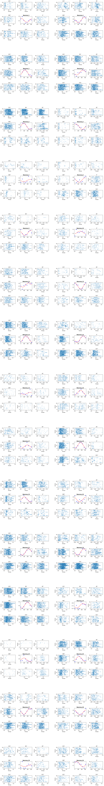
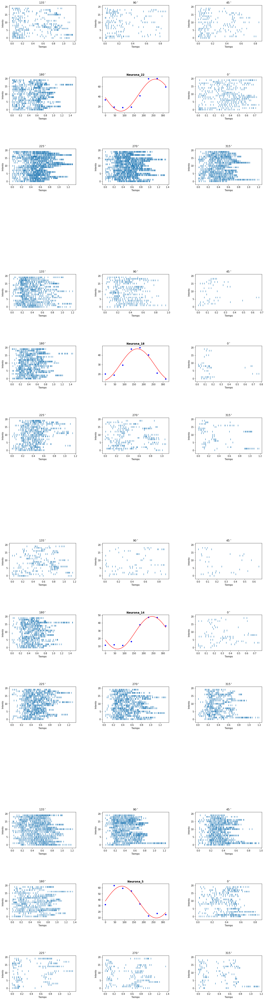

## Raster

Se generan los raster plot para cada

###### Importando archivos


```python
import scipy.io as sio
import matplotlib.pyplot as plot
import matplotlib.gridspec as gridspec
import matplotlib.patheffects as path_effects

at = sio.loadmat("motor_cortex_data.mat")

```


```python
neurona = 0
spikes = at["spk_rast"][0][neurona][0]
angles = at["spk_rast"][0][neurona][1]
```


```python
def calcularPromedio(intentos):
    promedios = []
    for intento in intentos:
        if(len(intento) == 0):
            continue
        
        prom = len(intento)/intento[-1] 
        promedios.append(prom)
    return np.mean(promedios)

```


```python
from pylab import rcParams
rcParams['figure.figsize'] = 15, 30
from scipy import optimize


def test_cos(x, a, b, c):
    return a * np.cos(np.radians(x - b)) + c

def fit(x, y):
    params, params_covariance = optimize.curve_fit(test_cos, x, y)
    return params, params_covariance

def calcularPromedioAngular(neurona, fig):
    angulos_string = [ "0", "45", "90", "135", "180","225", "270", "315"]
    promedios = []
    for index, angulo in enumerate(angulos_string):
        promedios.append(calcularPromedio(neurona.angulos[angulo]["intentos"]))
    angulos_int = np.array([float(a) for a in angulos_string])
    fig.set_title(r"$\bf{Neurona\_"+str(neurona.numero+1)+"}$")
    fig.plot(angulos_int,promedios, '.', color="blue", markersize=10)
    # FIT -> Coseno
    params, covariance = fit(angulos_int, promedios)
    x = np.linspace(0,315,100)
    fig.plot(x,test_cos(x, params[0], params[1], params[2]), '-', color="red", markersize=10)
    

#for index, neurona in enumerate(neuronas):
#    calcularPromedioAngular(neurona, plot.subplot(10, 3, index+1))
```


```python
import numpy as np
fig = plot.figure(figsize=(10, 8))

class Neurona:
    def __init__(self, data, numero):
        spikes = data[0]
        angles = data[1]
        self.numero = numero
        self.angulos = {
           "0":     {"angulo":[ 1.        ,  0.        ], "intentos":[]},
           "45":    {"angulo":np.array([ 0.70710678,  0.70710678]), "intentos":[]},
           "90":    {"angulo":[ 0.        ,  1.        ], "intentos":[]},
           "135":   {"angulo":[-0.70710678,  0.70710678], "intentos":[]},
           "180":   {"angulo":[-1.        ,  0.        ], "intentos":[]},
           "225":   {"angulo":[-0.70710678, -0.70710678], "intentos":[]},
           "270":   {"angulo":[ 0.        , -1.        ], "intentos":[]},
           "315":   {"angulo":[0.70710678 , -0.70710678], "intentos":[]}
        }
        for index, intento in enumerate(spikes):
            for key, angulo in self.angulos.items():
                if(np.array_equal(np.round(self.angulos[key]["angulo"]), np.round(angles[index]))):
                    self.angulos[key]["intentos"].append(list(filter(lambda x: not np.isnan(x), intento)))
                    break
    def graficarRaster(self, fig, outer):
        angulos_string = ["135", "90", "45", "180", "0", "225", "270", "315"]
        inner = gridspec.GridSpecFromSubplotSpec(3, 3, subplot_spec=outer, wspace=0.4, hspace=1)
        
        for index, angulo in enumerate(angulos_string):
            ax = plot.Subplot(fig, inner[index + (index>3)]) 
            self.rasterPlot(ax, self.angulos[angulo]["intentos"], angulo)
            fig.add_subplot(ax)
            
        ax = plot.Subplot(fig, inner[4]) 
        # Coseno
        #text = ax.text(0.5, 0.5, 'Neurona {}'.format(self.numero+1), ha='center', va='center', size=20)
        calcularPromedioAngular(self, ax)
        #text.set_path_effects([path_effects.Normal()])
        #ax.axis('off')
        fig.add_subplot(ax)
        
            
    def rasterPlot(self, fig, intentos, name):
        plot.subplots_adjust(left=None, bottom=None, right=None, top=None, wspace=0.4, hspace=0.4)
        fig.eventplot(intentos)#, color=colorCodes, linelengths = lineSize)     
        fig.set_title('${}^\circ$'.format(name))
        fig.set_xlabel('Tiempo')
        fig.set_ylabel('Intento')

```


    <Figure size 720x576 with 0 Axes>


```python
neuronas = []
for index, neurona in enumerate(at["spk_rast"][0]):
    neuronas.append(Neurona(neurona, index))
```

# Raster plots

A continuación se muestran los raster plots para cada neurona, en distintos angulos.


```python
fig = plot.figure(figsize=(20, 160))
outer = gridspec.GridSpec(15, 2, wspace=0.2, hspace=0.5)


for index, n in enumerate(neuronas):
    n.graficarRaster(fig, outer[index])
```





# Parte 2: tuning curves
Se seleccionan las neuronas 22, 18, 14 y 5


```python
fig = plot.figure(figsize=(20, 80))
outer = gridspec.GridSpec(4, 1, wspace=0.2, hspace=0.5)

neuronas_buenas = [neuronas[21], neuronas[17], neuronas[13], neuronas[4]]
for index, n in enumerate(neuronas_buenas):
    n.graficarRaster(fig, outer[index])
```




